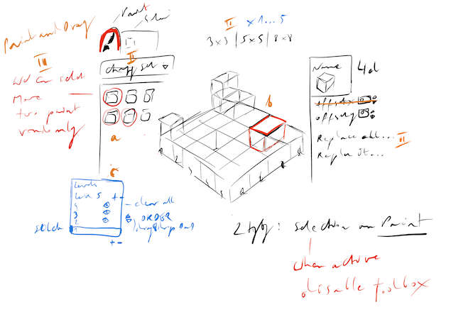

# zen-gardens

a tiny isometric block gardens builder (test)

## Main assumptions:
- only html, css and images (no canvas)
- all new
- with some nice licensed tile sets

### Phase I

#### Switchable tiles palette/atlas
- one at once - we cannot mix it (json + png)
- images + meta desc file
- full of blocks
- with names
- when switch we switch all tiles - in palette and on canvas
- searchable
- used counter
- show/hide not used
- multi selection (working with filters)
- active in `paint` mode / disabled in `selection` mode

#### Iso Canvas
- 5x5 or bigger? (selectable in Phase II)
- multilevel in the future (in Phase II)
- when `paint` mode we paint (by click and dragging)
- when we select more then one tile we randomize
- when `selection` mode we single select tile (and see it's options in Phase II)

## Base blueprint



## Develop

```
nx serve zen-gardens
nx lint zen-gardens
nx test zen-gardens
nx build zen-gardens
nx preview zen-gardens
```
